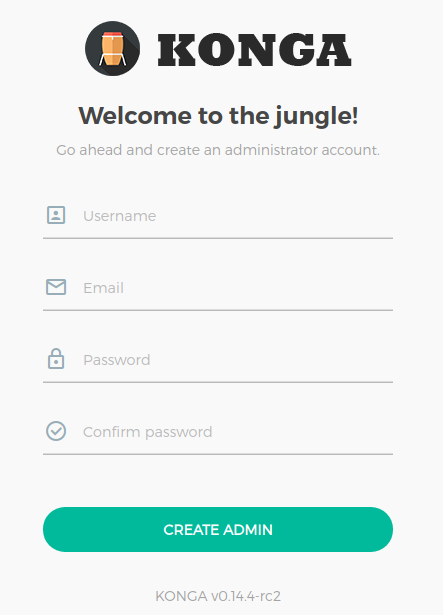
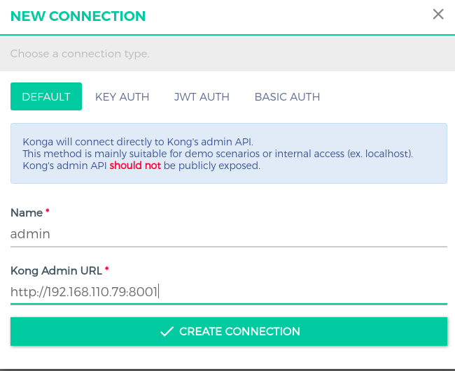

# Kong Demo using docker compose
This is a demo of the [Kong API Gateway](https://konghq.com/) which best practice as a proxy for a public web service as well

## Requirements
  - Linux, macOS, Windows 10
  - [Docker](https://www.docker.com)
  - [Docker Compose](https://docs.docker.com/compose/):
  

## Git clone

```
https://github.com/mituso89/kong-api-gateway.git
```

## Running


```
cd kong_docker_demo
```

Start the demo:

```
docker-compose up -d  
```

The compose file does 5 things: 

1.  Creates PostgreSQL for store data .
2.  Init data to Postgress.
3.  Builds anodejs container
4.  Runs the Kong API Gateway as a container.
5.  Runs the Konga as a container.

## Verify

```
docker ps
```

Verify that the Kong Gateway and Admin API are responding:

```
curl http://localhost:8000
curl http://localhost:8001
```

## login KongA

- we go to Konga (port 1337) to start using Kong using the browser and go to http://localhost:1337. Konga will ask us to create an account




- After creating an account and logging in, the first thing we need to do is connect Konga to Kong Server through Kong Admin. For this we will have to use the local network address of the machine we are using instead of localhost because Konga is being run in the Docker container. To check the address of the host, we can use the ifconfig command (with Unix, nettools installed).



## Create a Service Proxy

Now, create a local service named ***ip-service*** that will forward requests to the [Big Cloud Data API](https://www.bigdatacloud.com/). This is a two part process as both the service  and then the route must be established like so:

```
curl -i -X POST --url http://localhost:8001/services/ --data 'name=ip-service' --data 'url=https://api.bigdatacloud.net/'
curl -i -X POST --url http://localhost:8001/services/ip-service/routes --data 'hosts[]=ip-service'
```

You can now test both the plubic API and the proxied service using cURL:
```
curl https://api.bigdatacloud.net/data/client-ip
curl http://localhost:8000/data/client-ip --header 'Host: ip-service'
```

## Create a Microservice Endpoint

Following the recipe above, we can build an endpoint for the Node.js microservice:

```
curl -i -X POST --url http://localhost:8001/services/ --data 'name=time-service' --data 'url=http://kong-app:3000'
curl -i -X POST --url http://localhost:8001/services/time-service/routes --data 'hosts[]=time-service'
```

Recall that this service is running in the *kong-app* container and is exposed to the isolated Docker network via port 3000 but callers cannot access it without going through the API gateway. We can reach the ***time-service*** using the *Host* header:

```
curl http://localhost:8000 --header 'Host: time-service'
```

Use this endpoint to see a list of all the services enabled thus far:

```
curl http://localhost:8001/services
```

## Enable Rate Limiting

Added rate limiting (a maximum of 5 requests per minute in this case) to a service is as simple as running a single command:

```
curl -X POST http://localhost:8001/services/time-service/plugins/ --data "name=rate-limiting" --data "config.minute=5" --data "config.policy=local"
```

If you hit the *time-service* endpoint again, you will see additional headers in the response indicating the rate limit and usage:

```
curl http://localhost:8000 --header 'Host: time-service'
```

## Add Authorization

Key-based authorization can be add to the *time-service* endpoint by enabling the ***key-auth*** plugin, creating a user (*QA* in this example) and then providing the access key:

```
curl -i -X POST --url http://localhost:8001/services/time-service/plugins/ --data 'name=key-auth'
curl -i -X POST --url http://localhost:8001/consumers/ --data "username=QA"
curl -i -X POST --url http://localhost:8001/consumers/QA/key-auth/ --data 'key=Hello_Kong!'
```

Test the *time-service* endpoint both with and without specifying an API key:

```
curl http://localhost:8000 --header 'Host: time-service'
curl http://localhost:8000 --header 'Host: time-service' --header "apikey: Hello_Kong!"
```

## Conclusion

You have now added key-based authorization and rate limiting to a microservice without writing a single line of code.


## Clean Up

Tear everything down using:

```
docker-compose down
```

***
